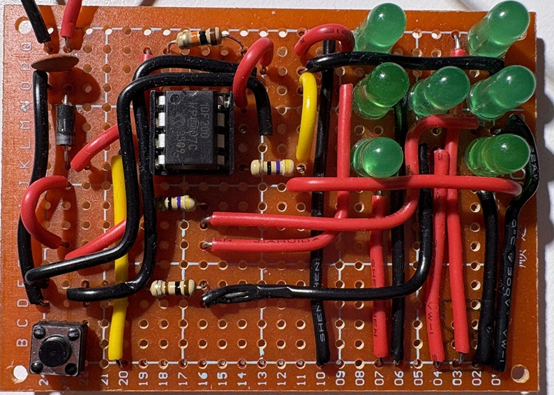

Energy-efficient electronic dice based on PIC10F200 microcontroller. Features 7-LED Charlieplexing display (driven by only 3 pins), sleep mode and optimized Assembly firmware fitting under 256 words.

# PIC10F200 ELECTRONIC DICE

Energy-efficient electronic dice based on PIC10F200 microcontroller. 
Features 7-LED Charlieplexing display (driven by only 3 pins), 
sleep mode and optimized Assembly firmware fitting under 256 words.

*PROJECT HIGHLIGHTS*

- **Charlieplexing**:
      Drives 7 individual LEDs using only 3 I/O pins (GP0, GP1, GP2)
- **Extreme Optimization**:
      The entire firmware (logic, animation, debouncing, display driver) fits in less than 256 instructions.
- **Low Power Design**:
      Uses Deep Sleep mode and Wake-up on Change to run for years on a single battery.
- **Robustness**:
      Implements software debouncing to handle noisy tactile switches.

  ### Video Demo

